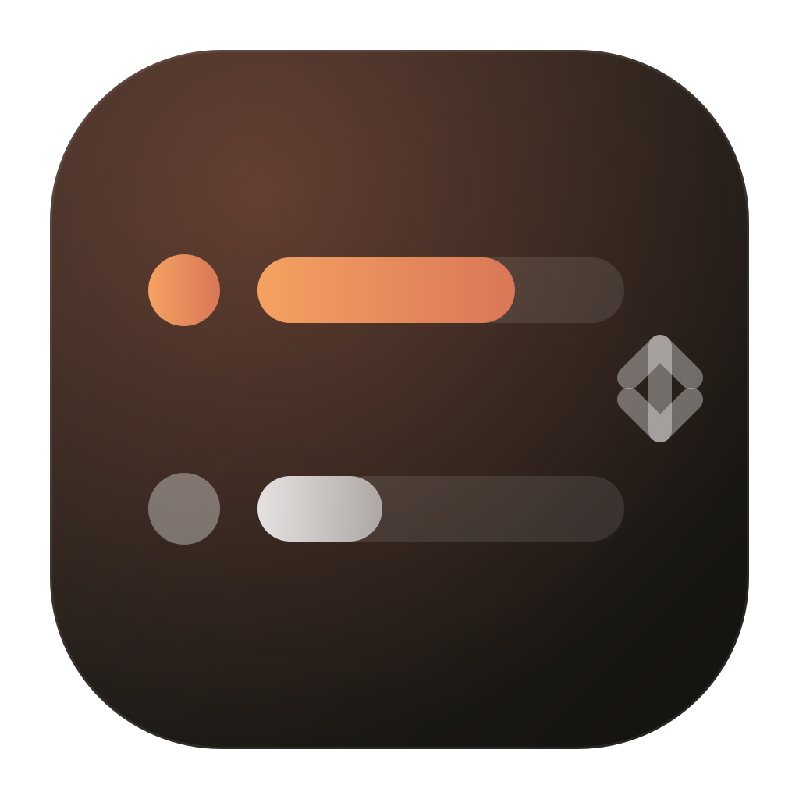

<p align="center">
  
</p>

<h1 align="center">Claude Account Switcher</h1>

<p align="center">
  Keep every Claude Code login. Switch in one click, or let the app switch for you when a limit runs out.<br/>
  A small menu bar / tray app for macOS, Linux and Windows, built with Tauri.
</p>

<p align="center">
  <a href="https://github.com/codextde/claude-account-switcher/actions/workflows/ci.yml"></a>
  <a href="https://github.com/codextde/claude-account-switcher/releases/latest"></a>
  <a href="LICENSE"></a>
  
</p>

---

`claude auth login` is destructive: every login wipes the previous account's credentials, and going back means another full browser round-trip. This app keeps a private backup of each account's credentials and swaps them in place, so all your accounts stay one click away.

## Features

- **Non-destructive switching.** Each account's OAuth token and identity block are backed up once. Switching writes them back atomically; nothing is ever logged out.
- **Automatic switching.** When the active account reaches the threshold (default 90% of its 5-hour or 7-day limit), the app moves to the account with the most headroom. Hysteresis and a cooldown prevent ping-pong.
- **Usage in the menu bar.** The tray icon is a live progress bar of the binding limit. On macOS it also shows the percentage as text. The popover shows session and weekly windows, model windows, and reset countdowns.
- **Terminal-free login.** Adding an account runs the official CLI login in the background and captures the result. The account you are already logged in with is adopted automatically on first launch.
- **Delegated token refresh.** The active account is refreshed through the CLI itself. Other accounts refresh through the OAuth endpoint, touching only the app's own backup.
- **Cross-platform.** macOS keychain, or `~/.claude/.credentials.json` on Linux and Windows. `CLAUDE_CONFIG_DIR` is honoured.
- **Native feel.** Vibrancy on macOS, Mica or acrylic on Windows, light and dark mode, launch at login, notifications on auto-switch.
- **Self-updating.** New releases are downloaded and signature-checked in the background, then installed the next time the app is idle. Can be turned off in Settings; "Check for updates…" lives in the tray menu.

## Install

Grab the latest build from the [Releases](https://github.com/codextde/claude-account-switcher/releases/latest) page.

| Platform | File |
|---|---|
| macOS (Apple Silicon) | `Claude.Account.Switcher_x.y.z_aarch64.dmg` |
| macOS (Intel) | `Claude.Account.Switcher_x.y.z_x64.dmg` |
| Linux | `.AppImage`, `.deb` or `.rpm` |
| Windows | `.msi` or `-setup.exe` |

macOS builds are not notarized unless the release was signed with an Apple Developer certificate. If Gatekeeper complains, right-click the app and choose **Open** once. If macOS reports the app as damaged, run:

```bash
xattr -dr com.apple.quarantine "/Applications/Claude Account Switcher.app"
```

Requirements: [Claude Code](https://docs.anthropic.com/en/docs/claude-code) installed and available as `claude`. The app searches the usual install locations; you can set an explicit path in Settings.

## Updates

The app checks the latest GitHub release shortly after launch and every six hours. When a newer version exists, it downloads the build, verifies its signature against the public key baked into the app, and installs it once nothing is going on: popover and settings closed, no login or switch in flight. macOS and Linux relaunch the app; on Windows the installer runs in passive mode and starts the app again.

- Turn it off with **Install updates automatically** in Settings. Manual checks still work from the tray menu and the settings window.
- A downloaded update waits until you close the popover, or you can install it right away with **Restart to update** in the tray menu.
- Linux `.deb` and `.rpm` installs need a privilege prompt to update, so those packages only update on request. AppImage updates in place.
- Debug builds (`pnpm tauri dev`) never auto-update.

## How it works

Claude Code stores two things per login:

1. The OAuth credential JSON. On macOS this is the keychain item `Claude Code-credentials`; on Linux and Windows it is `~/.claude/.credentials.json`.
2. An `oauthAccount` block in `~/.claude.json` with the email, organization and plan.

The app backs up both for each account in its own data directory (owner-only permissions). Switching:

1. Refuses if two accounts hold the same token (a corrupted backup).
2. Saves the outgoing account's live credentials, but only after verifying the identity on disk matches.
3. Writes the target account's credential JSON and `oauthAccount` block.
4. Verifies what landed on disk, then asks `claude auth status` to confirm. A missing email in the status output means another credential source (for example `ANTHROPIC_AUTH_TOKEN`) shadows the login and is reported, not treated as failure.

Running `claude` sessions pick up the new credentials on their next API call. That is CLI behaviour, so finish an in-flight session before switching if it matters.

Usage comes from Anthropic's OAuth usage endpoint using the account's own access token. Nothing is sent anywhere else.

On macOS the first keychain read triggers a system prompt because the item belongs to Claude Code. Choose **Always Allow**. The read goes through `/usr/bin/security`, so the grant sticks across app updates.

## Auto-switch rules

- The binding utilization of an account is the higher of its 5-hour and 7-day windows.
- A switch triggers when the active account's binding utilization is at or above the threshold.
- The target is the account with the lowest binding utilization that is at least `hysteresis` below the threshold and has valid stored credentials.
- Readings from expired windows are ignored. Accounts without a reading are never targets.
- A cooldown (default 10 minutes) applies between automatic switches.

## Development

```bash
pnpm install
pnpm tauri dev          # run with hot reload
pnpm tauri dev -- --show   # also open the popover on launch
pnpm tauri build        # produce installers for this platform
cargo test --manifest-path src-tauri/Cargo.toml
```

Linux needs the WebKitGTK and AppIndicator development packages; see `.github/workflows/ci.yml` for the exact list.

Layout:

```
src/                 React + Tailwind frontend (popover and settings windows)
src-tauri/src/
  credentials.rs     keychain / credential file / ~/.claude.json access
  cli.rs             finding and running the claude CLI
  usage.rs           usage endpoint and token refresh
  engine.rs          pure auto-switch decision logic
  service.rs         orchestration: polling, switching, login flows
  tray.rs            tray icon rendering, menu, popover window
  updater.rs         background check / download / idle install of new releases
```

## Releasing

Push a tag and the release workflow builds installers for all platforms and publishes a GitHub release:

```bash
git tag v1.0.0
git push origin v1.0.0
```

The tag must match the version in `src-tauri/tauri.conf.json`, `src-tauri/Cargo.toml` and `package.json`; the updater compares that version against the manifest.

Set `APPLE_CERTIFICATE`, `APPLE_CERTIFICATE_PASSWORD`, `APPLE_SIGNING_IDENTITY`, `APPLE_ID`, `APPLE_PASSWORD` and `APPLE_TEAM_ID` as repository secrets to get signed and notarized macOS builds. Without them the workflow still produces unsigned builds.

### Updater signing

Update bundles are signed with a minisign key. The public half is in `tauri.conf.json` under `plugins.updater.pubkey`; the private half must be available to the release workflow as the `TAURI_SIGNING_PRIVATE_KEY` secret (file contents) and `TAURI_SIGNING_PRIVATE_KEY_PASSWORD`. Releases built without the key ship no `latest.json`, and installed apps will not see them.

Keep the private key backed up. Rotating it means every existing install has to be updated by hand once, because it only trusts the key it was built with. To create a new pair:

```bash
pnpm tauri signer generate -w ~/.tauri/claude-account-switcher.key
gh secret set TAURI_SIGNING_PRIVATE_KEY < ~/.tauri/claude-account-switcher.key
gh secret set TAURI_SIGNING_PRIVATE_KEY_PASSWORD --body "<password>"
```

Then paste the contents of `claude-account-switcher.key.pub` into `plugins.updater.pubkey`.

## Acknowledgements

The credential swap and delegated refresh approach follows [CCSwitcher](https://github.com/XueshiQiao/CCSwitcher), a native macOS app with the same goal. This project brings the idea to Linux and Windows.

Not affiliated with Anthropic.

## License

[MIT](LICENSE)
